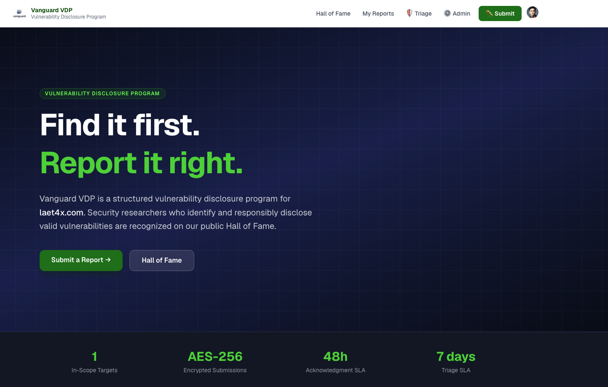
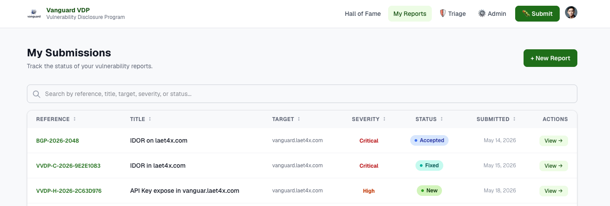
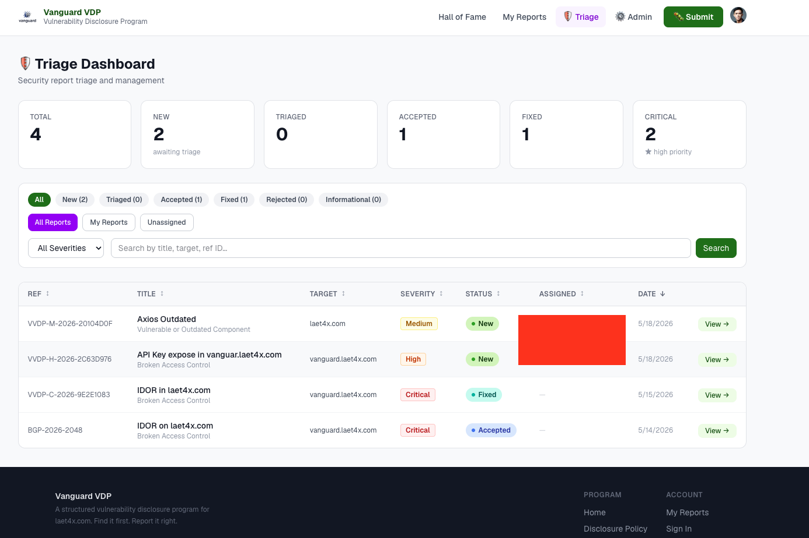
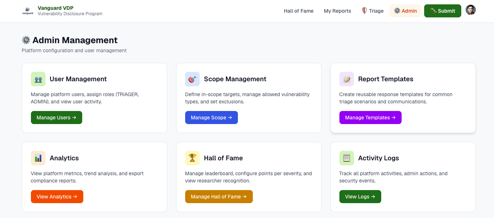

# Vanguard VDP

A modern vulnerability disclosure platform built for security researchers and security teams. Submit encrypted reports, track resolution status, and manage your bug bounty program with enterprise-grade features.

**Live:** https://vanguard.laet4x.com  
**Version:** v1.0.5-hotfix  
**Status:** 🧪 Public Alpha - Open for Testing

---

## 📸 Screenshots

### Landing Page

*Modern, clean interface with clear call-to-action for vulnerability submissions*

### Researcher Submission

*Encrypted report submission with comprehensive vulnerability details*

### Triager Dashboard

*Complete triage workflow with filtering, search, and status management*

### Admin Panel

*Comprehensive admin controls for analytics, users, and system configuration*

---

## Documentation

| Doc | Description |
|-----|-------------|
| [CHANGELOG.md](CHANGELOG.md) | Version history and feature releases |
| [docs/DEPLOYMENT_GUIDE.md](docs/DEPLOYMENT_GUIDE.md) | Full deployment, Cloudflare/Clerk/Google setup, common fixes |
| [docs/ROLE_SETUP_INSTRUCTIONS.md](docs/ROLE_SETUP_INSTRUCTIONS.md) | How to assign ADMIN/TRIAGER roles in Clerk |
| [docs/DATA_DELETION.md](docs/DATA_DELETION.md) | User data deletion guide (GDPR compliance) |
| [docs/blueprint.md](docs/blueprint.md) | Architecture, data model, API surface, security design |
| [docs/agent.md](docs/agent.md) | Developer persona — stack rules, failure modes, code patterns |
| [ISSUES.md](ISSUES.md) | Known issues, edge runtime pitfalls, debugging tips |
| [docs/ADMIN_FEATURES.md](docs/ADMIN_FEATURES.md) | Admin features roadmap and specifications |
| [docs/HALL_OF_FAME.md](docs/HALL_OF_FAME.md) | Hall of Fame system documentation |

## Tech Stack

| Layer | Technology |
|-------|-----------|
| Framework | Next.js 16.0.0 (App Router) |
| Runtime | Cloudflare Workers via `@opennextjs/cloudflare` |
| Database | Cloudflare D1 (SQLite) — binding `DB` |
| ORM | Drizzle ORM |
| Auth | Clerk v7 |
| Encryption | Web Crypto AES-GCM-256 |
| Styling | Tailwind CSS v4 |
| Validation | Zod v4 |

## ✅ Deployed Features

### 🔐 Core Platform Features
- ✅ **Report Submission** — AES-GCM-256 encrypted, authenticated users only
- ✅ **Researcher Dashboard** — View own submissions with status tracking
- ✅ **Report Detail View** — Full report viewing with markdown support
- ✅ **Comments System** — Two-way communication between researchers and triage team
- ✅ **Triage Workflow** — Complete report lifecycle management
- ✅ **Security Policy** — Responsible disclosure guidelines and scope

### 🏆 Hall of Fame System (v0.5.0-dev)
- ✅ **Public Leaderboard** — Points-based researcher rankings
- ✅ **Time Period Filters** — All Time, This Month, This Year views
- ✅ **Hacktivity Feed** — Real-time activity of accepted/resolved reports
- ✅ **Auto-Award System** — Automatic points on report acceptance
- ✅ **Visibility Management** — Per-entry public/private toggle
- ✅ **Points Configuration** — Customizable points per severity
- ✅ **Title Redaction** — Automatic removal of sensitive info (emails, IPs, tokens)
- ✅ **Researcher Profiles** — Clerk-integrated avatars and names
- ✅ **Admin Entry Management** — Search, pagination, and visibility control
- ✅ **Triage Integration** — Toggle visibility from report detail page

### 👥 User & Access Management
- ✅ **Role-Based Access Control** — USER, TRIAGER, ADMIN roles
- ✅ **User Management** (`/admin/users`) — List, search, sort, manage roles, view activity, and link to researcher reports
- ✅ **Role Promotion** — Promote users to TRIAGER with confirmation dialogs
- ✅ **Suspend / Unsuspend** — Clerk-backed user access controls for non-admin users
- ✅ **User Audit Trail** — Role and suspension changes recorded as user-scoped audit events
- ✅ **Safe ADMIN Management** — ADMIN role changes require manual Clerk access
- ✅ **Clerk Integration** — Seamless authentication with user profiles

### 🎯 Scope & Target Management
- ✅ **Scope Management** (`/admin/scope`) — Add, edit, archive, and restore in-scope targets
- ✅ **Target Types** — Web App, API, Mobile, Infrastructure
- ✅ **Status Tracking** — Active, Deprecated, Out of Scope
- ✅ **Per-Target Rules** — Allowed vulnerability types, severity restrictions, notes, and exclusion paths
- ✅ **Submission Enforcement** — Scope restrictions are shown in `/submit` and enforced by `POST /api/reports`
- ✅ **Dynamic Scope** — No hardcoded targets, fully database-driven

### 📊 Analytics & Reporting
- ✅ **Analytics Dashboard** (`/admin/analytics`) — Comprehensive metrics and insights
- ✅ **Summary Statistics** — Total reports, recent activity, response times
- ✅ **Data Visualizations** — Severity/status distributions, trends over time
- ✅ **Top Reporters** — Leaderboard with Clerk user names
- ✅ **Top Targets** — Most reported assets
- ✅ **CSV Export** — Export analytics data for compliance
- ✅ **Date Range Selector** — 7, 30, 90, or 365 days

### 📋 Activity Logs & Communication (v1.0.5-hotfix)
- ✅ **Centralized Activity Viewer** (`/admin/activity-logs`) — All platform activities in one place
- ✅ **Advanced Filtering** — Filter by action type, date range, actor, report ID
- ✅ **Timeline View** — Color-coded actions with icons (7 action types)
- ✅ **Search Functionality** — Real-time search across all log fields
- ✅ **Pagination** — 50 logs per page with navigation
- ✅ **CSV Export** — Export filtered logs for compliance and auditing
- ✅ **Actor Display** — Shows user names instead of emails or Clerk IDs
- ✅ **Report Links** — Direct links to triage page from log entries
- ✅ **Unified Timeline** — Merged comments and activity logs chronologically
- ✅ **Internal Comments** — Staff-only private notes on reports
- ✅ **Toggle Visibility** — Change comments/logs between internal and public
- ✅ **Text Wrapping** — Long content wraps properly in timeline
- ✅ **Email Privacy** — Zero email exposure across entire system

### 🔍 Modern Table Features (v0.4.0-dev)
All data tables include:
- ✅ **Search** — Real-time filtering across multiple fields
- ✅ **Column Sorting** — Click headers to sort ascending/descending
- ✅ **Pagination** — Smart pagination with 20-25 items per page
- ✅ **Result Counts** — Shows filtered/total results
- ✅ **Responsive Design** — Mobile and desktop optimized

**Tables Enhanced:**
- Researcher Dashboard (`/dashboard`)
- Triage Dashboard (`/triage`)
- User Management (`/admin/users`)
- Scope Management (`/admin/scope`)

### 🛡️ Security & Audit
- ✅ **End-to-End Encryption** — AES-GCM-256 for report bodies
- ✅ **Audit Logging** — Complete activity tracking for all report actions
- ✅ **Role-Based Permissions** — Middleware-enforced access control
- ✅ **Secure Decryption** — Staff and report owners can decrypt
- ✅ **Clean Audit Logs** — Only meaningful actions logged

### 💬 Communication Features
- ✅ **Comments System** — Researchers and staff can communicate
- ✅ **Internal Comments** — Staff-only private notes (🔒 icon)
- ✅ **Role Badges** — Visual indicators for USER/TRIAGER/ADMIN
- ✅ **Timestamps** — All comments timestamped
- ✅ **Markdown Support** — Rich text formatting in report descriptions
- ✅ **Unified Timeline** — Comments and audit logs merged chronologically
- ✅ **Toggle Visibility** — Staff can change internal/public status
- ✅ **Response Templates** — Quick responses for common scenarios

### 🎨 UI/UX Enhancements
- ✅ **Toast Notifications** — Success/error feedback
- ✅ **Confirmation Dialogs** — Prevent accidental actions
- ✅ **Status Badges** — Color-coded report statuses
- ✅ **Severity Indicators** — Visual severity classification
- ✅ **Responsive Tables** — Mobile-friendly data views
- ✅ **Loading States** — Smooth transitions and feedback

## Getting Started

```bash
npm install --legacy-peer-deps
cp .env.local.example .env.local  # fill in Clerk keys + ENCRYPTION_KEY
```

### Development

```bash
# Fast UI work — no D1 (hot reload)
npm run dev

# Full Cloudflare stack — D1 writes to .wrangler/state/
npm run dev:cf
```

> Use `npm run dev:cf` for anything that reads/writes the database. Plain `npm run dev` won't have the D1 binding.

### Required environment variables

```
ENCRYPTION_KEY=                        # 64 hex chars: openssl rand -hex 32
CLERK_SECRET_KEY=                      # From Clerk dashboard (sk_live_...)
NEXT_PUBLIC_CLERK_PUBLISHABLE_KEY=     # From Clerk dashboard (pk_live_...)
```

> These must also be pushed as Worker secrets:
> ```bash
> npx wrangler secret put CLERK_SECRET_KEY
> npx wrangler secret put NEXT_PUBLIC_CLERK_PUBLISHABLE_KEY
> npx wrangler secret put ENCRYPTION_KEY
> ```

### Database setup (first time)

```bash
# Remote (production)
npx wrangler d1 execute vanguard-security --remote --file=migrations/0001_schema.sql --yes
```

### Deploy

```bash
npm run deploy
```

## Project Structure

```
app/
├── page.tsx                          # Home — Security Policy
├── layout.tsx                        # Root layout + ClerkProvider
├── submit/page.tsx                   # Submit form (auth required)
├── dashboard/page.tsx                # Researcher's own submissions
├── hall-of-fame/page.tsx             # Public Hall of Fame
├── triage/page.tsx                   # Triage queue (TRIAGER/ADMIN only)
├── triage/reports/[id]/page.tsx      # Report detail + triage actions
├── admin/page.tsx                    # Admin console (ADMIN only)
├── sign-in/ & sign-up/               # Clerk auth pages
└── api/                              # API routes (no edge runtime flag needed)
lib/
├── db/                               # getDb(), getCfEnv(), Drizzle schema
├── crypto.ts                         # AES-GCM-256 encrypt/decrypt
├── validation.ts                     # Zod schemas + bootstrap scope targets
├── auth.ts                           # requireRole(), getSessionRole()
└── audit.ts                          # logAudit()
docs/
├── DEPLOYMENT_GUIDE.md               # Deployment + infrastructure config
├── MIGRATION_ORDER.md                # D1 migration apply order
├── ROLE_SETUP_INSTRUCTIONS.md        # Clerk role assignment
├── blueprint.md                      # Architecture reference
└── agent.md                          # Developer persona + lessons learned
migrations/
├── 0001_schema.sql                   # Base D1 schema: reports + audit_logs
├── 003_create_scopes_table.sql       # Dynamic scope targets
├── 004_create_comments_table.sql     # Researcher/staff comments
├── 0011_support_user_audit_logs.sql   # User/system audit entities
├── 0012_scope_enhancements.sql        # Scope restrictions + archive support
└── 0005+                             # Hall of Fame, templates, privacy, flags
```

## Roles

| Role | How to assign | Access |
|---|---|---|
| _(none)_ | Default for new users | Dashboard + submit only |
| `TRIAGER` | Set in Clerk publicMetadata | Triage panel — view & triage |
| `ADMIN` | Set in Clerk publicMetadata | Full admin access |

See [docs/ROLE_SETUP_INSTRUCTIONS.md](docs/ROLE_SETUP_INSTRUCTIONS.md) for step-by-step instructions.

## Pending Cleanup

```bash
# Remove unused AWS SDK if these packages are present (R2 was removed)
npm uninstall @aws-sdk/client-s3 @aws-sdk/s3-request-presigner --legacy-peer-deps

# Also safe to remove: [[r2_buckets]] block in wrangler.toml
```

## 🚀 Roadmap

### Current Feature Status

**Completed Admin Modules**
- [x] User Management (`/admin/users`) — Clerk user listing, search, sort, pagination, role updates, report links, activity details, suspend/unsuspend
- [x] Scope Management (`/admin/scope`) — Database-backed target CRUD, archive/restore, per-target restrictions, and dynamic submit form targets
- [x] Analytics Dashboard (`/admin/analytics`) — Metrics, distributions, trends, top reporters/targets, CSV export
- [x] Activity Logs (`/admin/activity-logs`) — Filtering, search, pagination, and CSV export
- [x] Hall of Fame Management (`/admin/hall-of-fame`) — Leaderboard, points config, visibility controls
- [x] Response Templates (`/admin/templates`) — Triage response templates with variables and preview

**Advanced Reporting & Analytics**
- [x] Analytics CSV export
- [x] Activity log CSV export
- [ ] Export filtered/sorted data from every table
- [ ] Custom calendar date range analytics
- [ ] Automated weekly/monthly reports
- [ ] Scheduled compliance report generation

**Notification System**
- [x] New report Discord webhook via `DISCORD_WEBHOOK_URL`
- [ ] Email notifications for report status changes
- [ ] In-app notification center
- [ ] Configurable webhook integrations for external tools
- [ ] Slack/Discord notification management UI
- [ ] Report assignment notifications

**Enhanced Collaboration**
- [x] Researcher/staff comments
- [x] Internal notes on reports (staff-only)
- [x] Unified comments and audit-log timeline
- [x] Response templates for common triage replies
- [ ] @mentions in comments
- [ ] Team activity feed

**Security & Compliance**
- [x] Audit log export
- [x] User data deletion guide and cleanup scripts
- [x] Email privacy cleanup from activity/audit displays
- [ ] Two-factor authentication policy/configuration
- [ ] Admin-managed data retention policies
- [ ] Automated backup and disaster recovery workflow
- [ ] Monitoring and alerting setup

**Researcher Experience**
- [x] Authenticated submission flow
- [x] Researcher dashboard and report detail pages
- [x] Two-way comments with triage team
- [ ] Report drafts (save before submit)
- [ ] Automatic duplicate detection
- [ ] Researcher-facing report templates for common vulnerabilities
- [ ] Submission wizard/guide
- [ ] Researcher opt-in/opt-out preferences for public recognition

**Triage Workflow**
- [x] Status lifecycle management
- [x] Assignment/self-assignment
- [x] Severity adjustment
- [x] Manual duplicate status support
- [ ] Bulk actions (assign/close multiple reports)
- [ ] Custom report labels/tags
- [ ] Saved filters
- [ ] Quick actions menu
- [ ] Bounty/reward tracking
- [ ] CVE/advisory linking

**Integration & API**
- [x] Clerk authentication integration
- [x] Optional Discord webhook for new report notifications
- [ ] Program Settings module (`/admin/settings`)
- [ ] Integration Management module (`/admin/integrations`)
- [ ] Public API for researchers
- [ ] Jira/GitHub issue integration
- [ ] Custom webhooks
- [ ] API documentation

**Dashboard Enhancements**
- [x] Search, sorting, pagination, and result counts across core tables
- [ ] Customizable widgets
- [ ] Real-time updates (WebSocket or server-sent events)
- [ ] Dark mode
- [ ] Keyboard shortcuts

### Release History

> **Note:** Earlier development builds used `0.x.y` versions. Current releases use `1.x.y` tags while the platform remains in public alpha.

**v1.0.5-hotfix (May 22, 2026)** - Current
- ✅ Email privacy hotfix across activity logs, audit logs, and user display
- ✅ Unified Timeline improvements
- ✅ Internal/public visibility toggles for comments and audit logs
- ✅ Response Templates integrated into triage communication
- ✅ Assigned triager display now uses names instead of email addresses

**v0.6.0-dev (May 18, 2026)**
- ✅ Activity Logs feature with centralized viewer
- ✅ Advanced filtering and search capabilities
- ✅ CSV export for compliance
- ✅ Color-coded timeline view
- ✅ User display improvements for activity logs
- ✅ User data deletion guide (GDPR compliance)

**v0.5.0-dev (May 16, 2026)**
- ✅ Complete Hall of Fame system with leaderboard and hacktivity
- ✅ Time period filtering (All Time, This Month, This Year)
- ✅ Visibility management with search and pagination
- ✅ Auto-award points system
- ✅ Points configuration interface
- ✅ Title redaction for privacy
- ✅ Edge runtime compatibility fixes

**v0.4.0-dev (May 15, 2026)**
- ✅ Modern table features (search, sort, pagination)
- ✅ User management improvements
- ✅ Search bar text color fix
- ✅ Audit log cleanup

**v0.3.0-dev (May 15, 2026)**
- ✅ Analytics dashboard
- ✅ Comments system
- ✅ Markdown rendering
- ✅ Report detail views

**v0.2.0-dev and earlier**
- ✅ Core platform features
- ✅ Role-based access control
- ✅ Scope management
- ✅ Triage workflow

---

### Production Readiness Roadmap

**Required before removing public-alpha status:**
- [ ] Security audit completion
- [ ] Comprehensive testing suite expansion (unit tests and public E2E smoke tests exist)
- [ ] Production deployment infrastructure
- [ ] User acceptance testing
- [ ] Performance optimization
- [ ] Complete documentation
- [ ] Backup and disaster recovery plan
- [ ] Monitoring and alerting setup

## License

Part of Vanguard VDP's public security transparency programme. All content is public domain unless otherwise specified.

## Contact

**Security Issues & Bug Reports:**  
Please create an issue on our [GitHub repository](https://github.com/fr4nc1stein/vanguard/issues)

### ⚠️ Before First Deployment

1. Create D1 database: `wrangler d1 create vanguard-security`
2. Paste returned `database_id` into `wrangler.toml`
3. Run local migration: `npm run db:migrate:local`
4. Run remote migration: `npm run db:migrate:remote`
5. Set env vars in `.env` and Cloudflare dashboard:
   - `ENCRYPTION_KEY` → `openssl rand -hex 32`
   - `CLERK_SECRET_KEY` → from Clerk dashboard
   - `NEXT_PUBLIC_CLERK_PUBLISHABLE_KEY` → from Clerk dashboard
   - `DISCORD_WEBHOOK_URL` → optional
6. Deploy: `npm run deploy`
7. Set Clerk redirect URLs in Clerk dashboard to the deployed Pages domain
